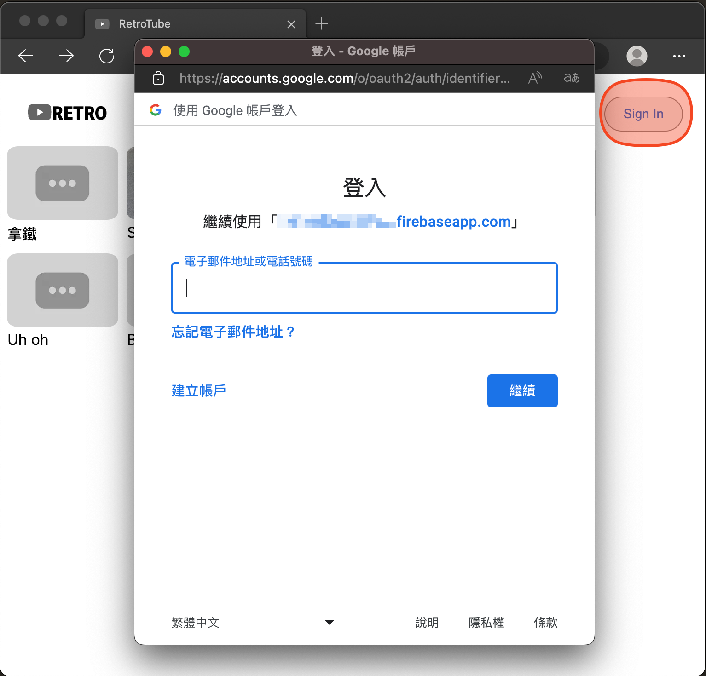

# RetroTube Web Client
The bright appearance in the screenshots of the videos is due to the HDR sources.

1. Home Page

2. Login (Sign in with Google)

3. After login the account will appear on the top right

4. Watch page

5. Video selection, loading screen, and watch page

6. upload video

7. Upload scenarios
    - Upload Successfully:  
    Give success message and return the user to the home page
    - Upload Unsuccessful:  
    Give error message and return the user to the home page
    - Upload without login:
    
8. Passing wrong video id to watch page
